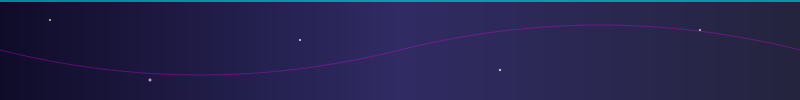

I'm a **Senior Software Engineer** based in Europe 🇪🇺.

- 👩‍💻 **Expertise**: Full-stack JavaScript/TypeScript development and AWS cloud architecture.
- 🔧 **Tech Stack**: TypeScript, NestJS, Next.js, AWS, Prisma, Redis, and various third-party API integrations (Stripe, Contentful).
- 👯 **Looking to collaborate on**: Agentic AI projects, LLM orchestration tools, and autonomous workflow systems.
- 🌱 **Currently learning**: Agentic AI frameworks (LangGraph.js, RAG systems).
- 💬 **Ask me about**: AWS architecture, TypeScript, NestJS, Next.js, or making the jump from software engineering to AI development.
- ⚡ **Fun fact**: I paint wildlife & landscapes with acrylics 🎨 and my first career was in geological engineering!

### Languages

### Frameworks & Libraries

### Cloud & Infrastructure

---

> **Recently completed Udacity's Agentic AI Nanodegree** 🎓

I am deeply focused on mastering **Agentic AI**, building systems where LLMs can reason, plan, and execute tasks autonomously. My current learning path includes:

- **Frameworks**: LangChain, LangGraph.js, AutoGen
- **Concepts**: RAG Systems, Tool Use, Multi-Agent Orchestration
- **Goal**: To bridge the gap between traditional software engineering and autonomous AI agents.

---

---

<table align="center">
<tr>
<td align="center" width="50%">

</td>
</tr>
</table>

---

- 🎨 **Artist**: I'm an acrylic painter, focusing on wildlife and landscapes.
- 🧘‍♀️ **Wellness**: Passionate about biohacking, supplements, and wellness optimization.
- 🌍 **Multilingual**: I speak multiple languages and love connecting with people from different cultures.

---

> "The gap between 'stuck' and 'solved' is usually one more search, one more coffee, one more try."

---

